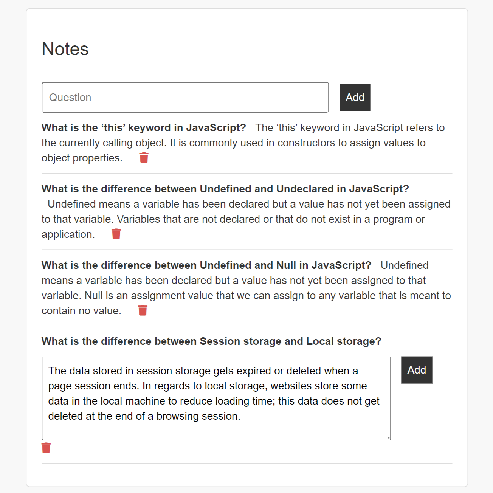

# Cornell Notes App 🤓📚✏️

## Description
Welcome to the Cornell Notes App, a platform designed for efficient Cornell-style note-taking. The Cornell method of organizing notes generally involves two columns of text: a question/keyword column & an answer/notes column. With a user-friendly interface, this app allows users to sign up, log in, and create/delete their notes (question + answer pairs) seamlessly.

### How to Use
1. Sign up or log in using existing credentials.
2. Enter your question in the "Question" input and click on "Add."
3. Once a question has been created, an answer area appears. Enter your answer and click on "Add."
4. Delete a note using the trash icon associated with each note.

### Features
- **User Authentication**: Implements Passport.js for secure local authentication, ensuring user data protection.
- **Note Management**: Add and delete notes (question + answer pairs) for organized note-taking.
- **Dynamic Messages**: View notes from other users, allowing for note-taking in a teamwork setting.
- **Real-time Updates**: Dynamic updates to the UI when adding and deleting notes for a seamless user experience.

### Tech Used
- **HTML/CSS/JavaScript**: Frontend technologies for building an interactive and engaging user interface.
- **Node.js**: Backend JavaScript runtime.
- **Express.js**: Web application framework for Node.js, simplifying route handling and middleware integration.
- **Embedded JavaScript (EJS)**: Templating engine for rendering dynamic content, simplifying the integration of server-side variables into HTML.
- **MongoDB**: NoSQL database for storing user information and notes.